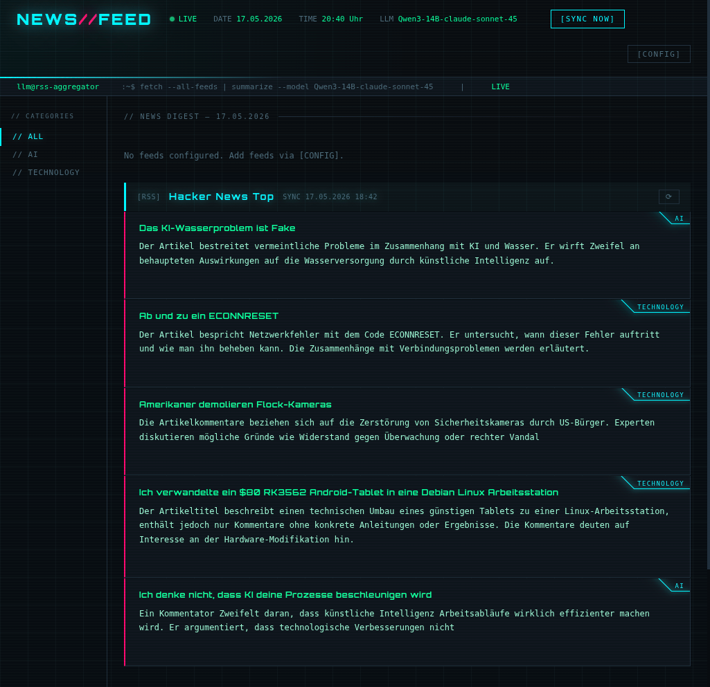

# feed-reader-llm

Experimental RSS feed aggregator that summarizes articles in different languages using a local LLM and serves the result as a self-hosted cyberpunk-styled HTML page. There are better feed reader with llm integrations, this is just a experimental way to see what i can do with a local llm.



## Features

- Fetches configured RSS feeds from a PostgreSQL database
- Summarizes each article in 2-3 sentences via a local LLM (OpenAI-compatible API)
- **Article deduplication** — summaries are stored in the DB; an article is only sent to the LLM once, identified by its URL. Re-syncing a feed skips already-known articles entirely.
- **Live block rendering** — each feed is a separate block that appears as soon as it is ready; no waiting for all feeds to complete
- **Config panel** — in-browser management of RSS sources (add, delete, enable/disable)
- **Sync Now** — triggers an immediate full refresh; reloads the page when done
- **Per-feed sync** — each block has its own sync button to refresh just that feed without touching the others
- Enable/disable a feed in the config panel instantly adds or removes its block from the main page
- **Category sidebar** — each article is automatically classified into a free-form category by the LLM (e.g. Politics, Security, Art, Finance) in the same call that produces the summary; the sidebar is built dynamically from all categories present in the database and filters the feed blocks
- **Configurable summary language** — choose the language for summaries and article titles in the CONF LLM dialog (German, English, French, Spanish, Italian, Portuguese, Dutch, Polish, Turkish); changing the language triggers a full re-translation on the next sync
- **Translated article titles** — article titles are translated into the selected language by the LLM alongside the summary; the translated title is shown in the feed blocks

## Architecture

```
┌─────────────────────────────────────────────────┐
│  Kubernetes Pod (namespace: feedreader)         │
│                                                 │
│  ┌──────────┐   /html volume   ┌─────────────┐  │
│  │  nginx   │◄────────────────►│  generator  │  │
│  │  :80     │                  │  (cron loop)│  │
│  └────┬─────┘                  └─────────────┘  │
│       │ /api/ proxy                             │
│       ▼                                         │
│  ┌─────────────┐               ┌─────────────┐  │
│  │ api-server  │◄──/html vol──►│ PostgreSQL  │  │
│  │ Flask :5000 │               │  (external) │  │
│  └─────────────┘               └─────────────┘  │
└─────────────────────────────────────────────────┘
```

| Container | Image | Role |
|---|---|---|
| `init-db` | `postgres:16-alpine` | Init container — creates `sources` table if it does not exist |
| `nginx` | `nginx:alpine` | Serves `index.html` shell and block files, proxies `/api/` to Flask |
| `generator` | `python:3.12-slim` | Fetches feeds, calls LLM for new articles, writes shell and per-feed block files |
| `api-server` | `python:3.12-slim` | Flask REST API for the config panel and block serving |

### Render flow

The page is built from a static shell plus independent per-feed blocks:

1. `index.html` is a shell with one HTMX loading slot per enabled feed (`/html/blocks/<uuid>.html`)
2. The browser polls `/api/block/<uuid>` for each slot until the block file exists
3. The generator writes each block file as soon as that feed is processed — other feeds appear without waiting
4. Block files persist across syncs; existing content stays visible while the generator runs in the background

### Sync triggers

| Trigger | Effect |
|---|---|
| `[SYNC NOW]` button | Writes `/html/.sync-now`; generator picks it up within 60 s and processes all enabled feeds regardless of their interval; page reloads when done |
| Per-feed `⟳` button | Writes `/html/.sync-feed-<uuid>`; generator processes only that feed via `--feed <uuid>`; other blocks untouched |
| Scheduled interval | Generator checks every 60 s whether each feed's `sync_interval_minutes` has elapsed; feeds not yet due are skipped |

## Category sidebar

Each article receives a single English category word assigned by the LLM during summarization — no fixed vocabulary, the model chooses freely based on the article content. Examples: `Security`, `Politics`, `Art`, `Finance`, `Science`.

The sidebar on the left is built entirely from the categories currently present in the database. Clicking a category filters the visible feed blocks to only those that contain at least one article in that category. Clicking `// ALL` resets the filter.

### How categories are assigned

The LLM is asked to respond in a strict two-line format:

```
CATEGORY: Technology
SUMMARY: German summary of the article.
```

Both are extracted in a single API call. Articles that already have a summary but no category (e.g. after upgrading from an older version) are backfilled on the next sync using a lightweight title-only classification call.

## Article deduplication

Before calling the LLM, the generator checks the `articles` table for each article URL:

```python
cur.execute("SELECT url FROM articles WHERE url = ANY(%s)", (urls,))
existing = {row[0] for row in cur.fetchall()}
# articles whose URL is already in DB are skipped — LLM is not called
```

An article URL is the stable unique identifier. If it is already in the `articles` table the summary is reused as-is, regardless of how many times the feed is synced. The LLM is only called for genuinely new articles.

## Database

PostgreSQL database `feedconfig`. The `init-db` init container creates the `sources` table automatically on first deploy via `CREATE TABLE IF NOT EXISTS`.

### `sources` table (active)

| Column | Type | Description |
|---|---|---|
| `id` | `SERIAL` | Primary key (integer, auto-increment) |
| `name` | `TEXT` | Display name |
| `url` | `TEXT UNIQUE` | Feed URL |
| `enabled` | `BOOLEAN` | Whether the feed is included in syncs |
| `sync_interval_minutes` | `INTEGER` | Per-feed sync interval in minutes (default 360) |
| `max_articles` | `INTEGER` | Max articles fetched per sync (default 5, range 1–20) |
| `category` | `TEXT` | Comma-separated category words derived from article categories |
| `last_fetched_at` | `TIMESTAMPTZ` | Updated after each successful fetch |

### `articles` table (active)

| Column | Type | Description |
|---|---|---|
| `id` | `UUID` | Primary key |
| `source_id` | `INTEGER` | References `sources.id` |
| `title_original` | `TEXT` | Article title from RSS |
| `url` | `TEXT UNIQUE` | Article URL — used for deduplication |
| `summary_llm` | `TEXT` | Summary generated by LLM in the configured language |
| `title_translated` | `TEXT` | Article title translated by LLM into the configured language |
| `category` | `TEXT` | Single English topic word assigned by LLM (e.g. `Security`, `Politics`, `Art`) |
| `llm_error` | `BOOLEAN` | True if LLM call failed |
| `published_at` | `TIMESTAMPTZ` | Publication date from RSS feed |
| `fetched_at` | `TIMESTAMPTZ` | When the article was stored |

### `llm_config` table

Single-row table for LLM connection settings, editable via the CONF LLM dialog.

| Column | Type | Description |
|---|---|---|
| `id` | `UUID` | Primary key |
| `url` | `TEXT` | OpenAI-compatible API base URL |
| `api_key` | `TEXT` | API key (`none` if not required) |
| `summary_language` | `TEXT` | Language for summaries and translated titles (default `German`) |

## Getting Started

### Prerequisites

| Requirement | Notes |
|---|---|
| Kubernetes cluster | Tested on k3s / kubeadm |
| PostgreSQL | [CloudNative-PG](https://cloudnative-pg.io/) recommended; any PostgreSQL reachable inside the cluster works |
| OpenAI-compatible LLM | [Ollama](https://ollama.com/), llama.cpp server, LM Studio, or any hosted API |
| ArgoCD **or** kubectl ≥ 1.14 | ArgoCD for GitOps; plain `kubectl apply -k` also works |

### 1 — Create the namespace and database secret

```bash
kubectl create namespace feedreader

kubectl create secret generic feeduser-credentials \
  --namespace feedreader \
  --from-literal=username=<db-user> \
  --from-literal=password=<db-password>
```

The database itself must already exist and be reachable as a Kubernetes service. The init container creates all tables automatically on first start.

### 2 — Adjust cluster-specific values

Edit these files before deploying:

| File | What to change |
|---|---|
| `k8s/deployment.yaml` | `LLM_BASE_URL` — base URL of your LLM (e.g. `http://ollama.default.svc:11434/v1`) |
| `k8s/deployment.yaml` | `DB_HOST` — Kubernetes service name of your PostgreSQL instance |
| `k8s/ingress.yaml` | `host` — your domain; TLS annotations to match your cert-manager / ingress setup |

### 3 — Deploy

**Via ArgoCD** — create an Application pointing at this repo with `path: k8s`:

```yaml
source:
  repoURL: https://github.com/your-fork/feed-reader-llm
  targetRevision: main
  path: k8s
destination:
  server: https://kubernetes.default.svc
  namespace: feedreader
```

ArgoCD detects the `kustomization.yaml` automatically and runs `kustomize build` on each sync.

**Via kubectl**:

```bash
kubectl apply -k k8s/
```

### 4 — Add your first feeds

Once the pod is running, open the URL you configured in `ingress.yaml`. Click `[CONFIG]` in the top-right corner and add RSS feed URLs. The generator picks them up on its next 60-second tick.

To trigger an immediate sync, click `[SYNC NOW]`.

---

## Deployment

The project runs on Kubernetes via ArgoCD. All manifests are in `k8s/`.

### Files

| File | Purpose |
|---|---|
| `k8s/news_feed_cyberpunk.py` | Main generator script |
| `k8s/api_server.py` | Flask config and block API |
| `k8s/nginx-default.conf` | nginx server config |
| `k8s/nginx-loading.html` | Loading page served while the generator runs |
| `k8s/kustomization.yaml` | Kustomize config — generates all ConfigMaps from the source files |
| `k8s/deployment.yaml` | Deployment (init container owns the full DB schema) |
| `k8s/service.yaml` | Service |
| `k8s/ingress.yaml` | Ingress — adjust host and TLS issuer for your cluster |

### First deploy

Point an ArgoCD Application at this repo with `path: k8s`. On first sync:

1. The init container connects to PostgreSQL and creates the `sources` table.
2. The generator and API server start — the page shows the loading screen until the first run completes.
3. Add RSS sources via the `[CONFIG]` button in the web UI.

### Cluster-specific values

Before deploying to a new cluster, adjust these values in `k8s/`:

| File | Value | Description |
|---|---|---|
| `deployment.yaml` | `LLM_BASE_URL` | URL of your OpenAI-compatible LLM endpoint |
| `deployment.yaml` | `DB_HOST` | CloudNative-PG cluster read-write service name |
| `ingress.yaml` | host + TLS annotations | Adjust to your ingress controller and cert-manager setup |

### Updating the scripts

The Python scripts live in `k8s/` and are embedded into a ConfigMap automatically by Kustomize on each ArgoCD sync. No manual generation step required — just edit, commit, and push:

```bash
git add k8s/news_feed_cyberpunk.py   # or k8s/api_server.py
git commit -m "..."
git push
```

ArgoCD runs `kustomize build` server-side. Because the ConfigMap name includes a content hash, any change to the Python files triggers an automatic pod rollout.

### Environment variables

| Variable | Description |
|---|---|
| `DB_HOST` | PostgreSQL host |
| `DB_NAME` | Database name (`feedconfig`) |
| `DB_USER` | Database user (from secret) |
| `DB_PASSWORD` | Database password (from secret) |
| `DB_PORT` | PostgreSQL port (`5432`) |
| `LLM_BASE_URL` | OpenAI-compatible LLM base URL |
| `OUTPUT_FILE` | Output path for the shell HTML file (default: `news_zusammenfassung.html`) |

## API endpoints

| Endpoint | Method | Description |
|---|---|---|
| `/api/sources` | GET | All sources as HTMX table rows |
| `/api/add-form` | GET | Add-source form HTML |
| `/api/add` | POST | Validates RSS URL, inserts into DB, appends block slot to main page |
| `/api/toggle` | POST | Toggles `enabled`; adds or removes block slot on main page |
| `/api/delete` | POST | Removes source from DB |
| `/api/block/<uuid>` | GET | Returns block HTML if ready, otherwise a self-polling loading placeholder |
| `/api/sync` | POST | Triggers full sync (all enabled feeds) |
| `/api/sync/<uuid>` | POST | Triggers sync for one feed; deletes its block file to force loading state |
| `/api/sync/status` | GET | Returns current global sync status badge |

## Local development

```bash
pip install feedparser requests psycopg2-binary flask

# Run the generator once (requires DB env vars + reachable LLM)
python k8s/news_feed_cyberpunk.py

# Process a single feed by source ID
python k8s/news_feed_cyberpunk.py --feed <id>

# Run the API server
python k8s/api_server.py
```
